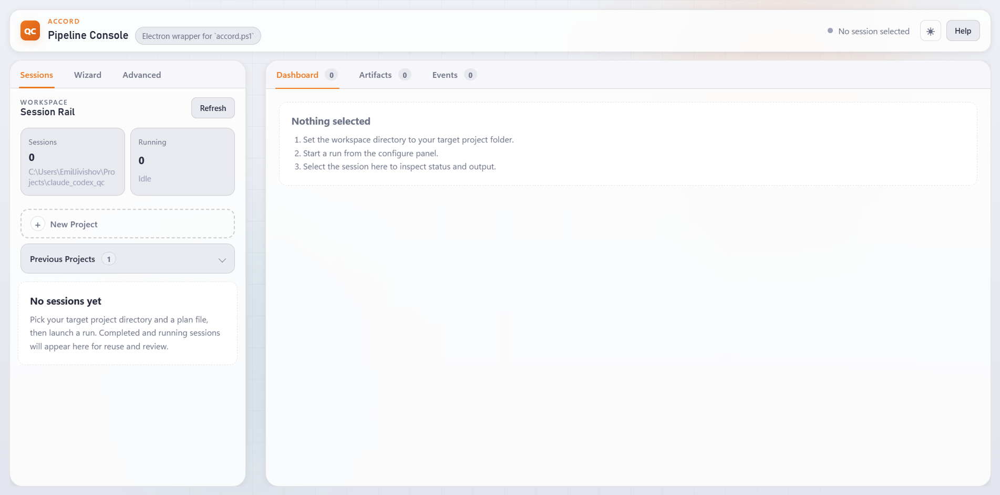
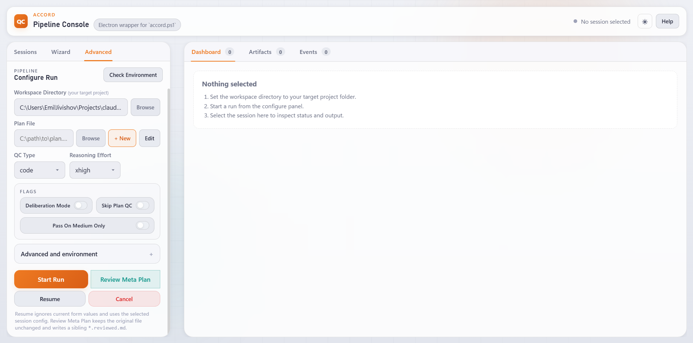
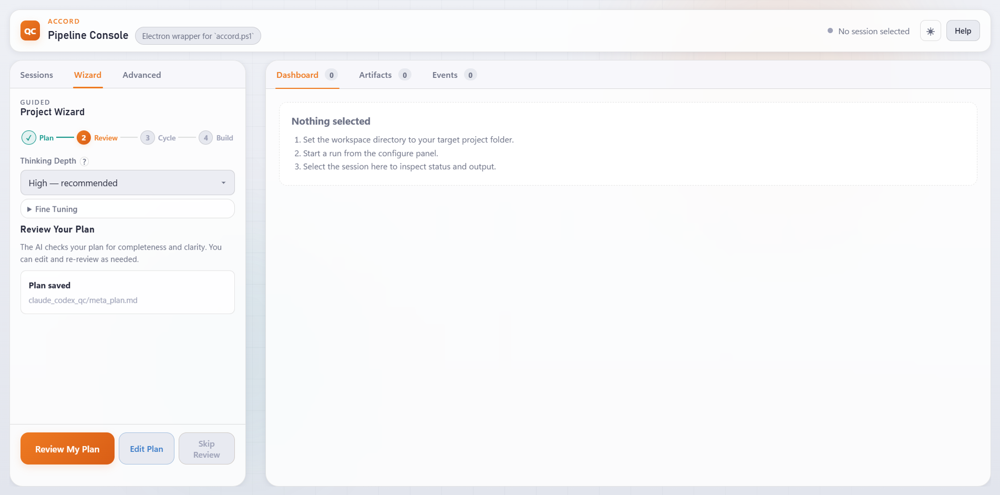

# Accord

Accord is a Windows-first Electron desktop app for running a controlled cross-model QC workflow. It is built around a simple operating model: one model produces the first serious draft, the other reviews it, and the user can inspect every handoff. In practice, Accord leans on Claude for the main drafting stages and on Codex for critique, review, and technical feedback.

## Why Accord

Accord is not trying to simulate a swarm. It keeps the workflow sequential and legible: Claude produces the first pass for document generation or code implementation, Codex reviews that output, and the user can inspect reports, artifacts, and session history before deciding what happens next. That makes the pipeline easier to supervise than systems that spread work across many hidden agents at once.

## Why Claude Starts the Main Drafting Stages

Claude is often preferred for first-draft work such as writing, UI framing, idea generation, and broad solution shaping. Accord uses that bias where it matters most: in the main document and code authoring stages, Claude starts by generating the draft and Codex follows with review, critique, and concrete next-step feedback.

In standard mode, Codex reviews Claude's output and Claude fixes what Codex reports. In deliberation mode, the two models iterate in structured rounds so Claude can refine its work against Codex's feedback until they converge. For accuracy: the optional Phase 0 plan QC step is still Codex-first in the current pipeline, so Claude does not literally start every stage.

## Why Not a Swarm

Agent swarms are popular right now, but they also tend to multiply context, duplicate effort, and drive token usage up quickly. Accord is a bounded alternative for cases where that overhead is not justified. It keeps the loop economical, sequential, and user-auditable, which is useful when parallel agents are too expensive, too opaque, or simply harder to control than the task requires.

## Prerequisites

Install and make sure these commands are available on `PATH`:

- Node.js 18+
- PowerShell 5.1+ (or PowerShell 7+)
- Git
- Claude Code CLI: `npm i -g @anthropic-ai/claude-code`
- Codex CLI: `npm i -g @openai/codex`

## Install From Source

```powershell
# Clone the repo
git clone https://github.com/jivishov/accord.git
cd accord

# Install dependencies
npm install --package-lock=false
```

## Run Accord

```powershell
npm start
```

The app opens the Pipeline Console desktop UI.

## App Screenshots

### Dashboard



### Configure Run (Advanced)



### Project Wizard



## First-Time Setup In The App

1. Open the **Advanced** tab.
2. Set **Workspace Directory** to your target project.
3. Set **Plan File** to the plan you want to execute.
4. Click **Check Environment** and confirm `powershell`, `git`, `claude`, and `codex` are detected.
5. Click **Start Run**.

## Basic Usage Flow

1. Start a run from **Advanced** or use the **Wizard** flow.
2. Claude produces the first substantive draft for the selected document or code stage.
3. Codex reviews that output, critiques it, and points to the next changes.
4. Inspect reports and artifacts in **Dashboard**, **Events**, and **Artifacts**.
5. Let the next iteration proceed from visible feedback, or resume/cancel from the session controls when needed.

## Verify The App

```powershell
npm run smoke
```

## Generate/Refresh README Screenshots

```powershell
npm run screenshots
```

This command launches Electron in capture mode and writes:

- `docs/screenshots/dashboard.png`
- `docs/screenshots/configure.png`
- `docs/screenshots/wizard.png`

## Build Windows Installer

```powershell
npm run dist
```

Generated installer artifacts are written to `dist/`.

## Troubleshooting

- `claude` or `codex` not found: reinstall globally and reopen terminal.
- PowerShell execution issues: run shell as Administrator and verify execution policy.
- App starts but workflows fail: use **Check Environment** and confirm all required commands resolve.

## Additional Docs

- [Desktop Guide](docs/help/desktop-guide.md)
- [Quick Start](docs/help/quick-start.md)
- [Pipeline and Modes](docs/help/pipeline-and-modes.md)
